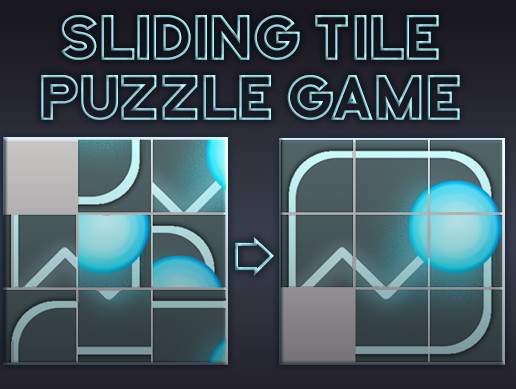
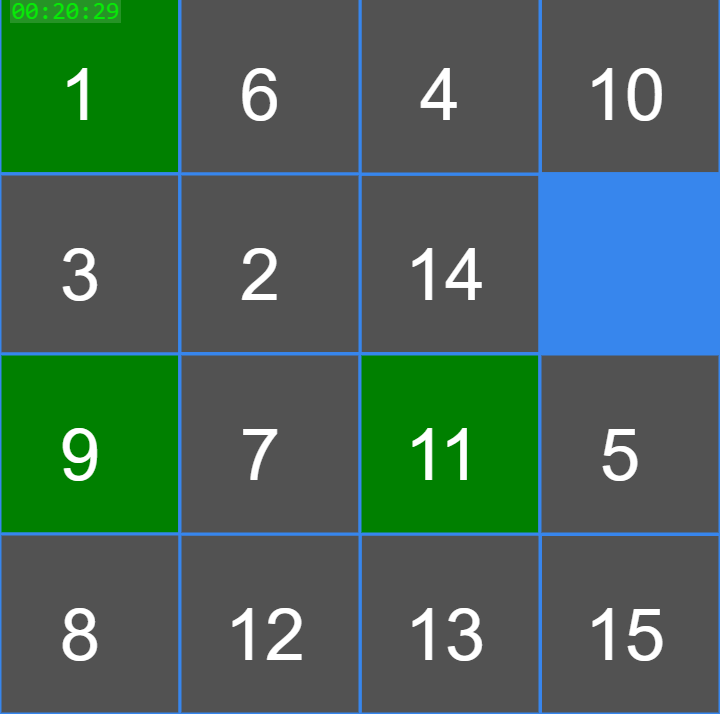
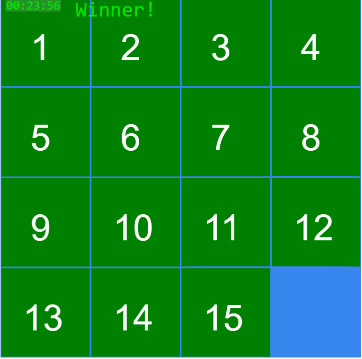

# The tile puzzle game: using serching algorithms 

Implementation of "Tail Puzzle" game using 5 searching algorithms (BFS, DFID, A*, IDA*, DFBnB). 

-----------------------
For each one of the Algorithms: 
Find the optimum solution <==> If there is any solution (one or few) 

-----------------------

In order to run the code you must download all the files to your computer. 
You are required to enter the input1.txt file where you can understand how to set up the gaming board in order to run one of the algorithms and see if there is a solution for the input tile puzzle board.

example:

-----------------------
IDA*              
with time             
no open           
4x4                 
Black:       
Red:           
1,6,4,10  
3,2,14,_  
9,7,11,5  
8,12,13,15  

-----------------------

IDA*           -----> Here you tipe the name of the requier algorithm - BFS, DFID, A*, IDA*, DFBnB.

with time      -----> If you want to see the runtime of the algorithm until it finds the solution write down "with time" otherwise leave "no time".

no open        -----> If you write in the input file is "no open" all the output will be written to the output.txt file and nothing will be printed in the console.
                      If "with open" is written, the algorithm will run on the console, in each row you will see the "open list" of the search graph, until the solution is                           found. 
                      
3x4            -----> In this row you enter the size of the board (NxM)

Black:         -----> (Not necessary) Here you can set the "black collor" cells, those will not be able to move during the game.

Red:           -----> (Not necessary) Here you can set the red cells when moving this cell the "cost" of moving will be 30 points.
                      For all the cells that not selected as 'red' or 'black', will set to the 'green' collor automatically, And for each move of green cell will cost 1 point.
                      
    
    -----> Example of input board.
          
1,6,4,10  
3,2,14,_  
9,7,11,5  
8,12,13,15  

example: 

The output to -> output.txt

-----------------------
10D-4R-6R-2U-3R-9U-8U-12L-13L-11D-7R-8R-12U-13L-11L-7D-8R-12R-9D-1D-2L-3U-14L-10L-5U-8R-12R-14D-10L-5L-8U-12R-7U-11R-14D-10D-5L-6D-3R-2R-1U-5L-6L-7U-11U-15L  
Num: 2492525   
Cost: 46  
325.1204642 seconds  

-----------------------

explain the resoults:

10D-4R-6R-2U-3R-9U-8U ... represent the path to solve the board  
Num: 2492525              represent the nunber of node that create in the graph search   
Cost: 46                  represebt the cost for the cell moves (10 points for green, 30 points for red)  

so now we can cheack the resulte from the algorithm. 
10D - take the 10's number cell one step doun. 
4R - take the 4's number cell one step right. 
6R 
2U 
3R 
... 

Best web for getting a shuffle board and cheak the correct results: 
https://appzaza.com/tile-slide-game 

enjoy.
